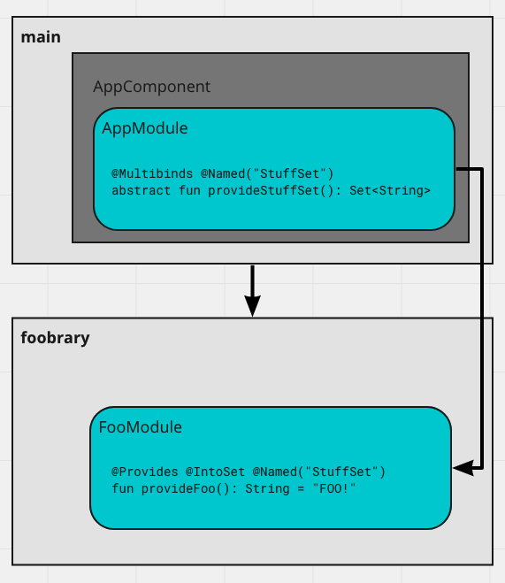

# LearnuaDagger

## Multibinding in separate Gradle module + separate Dagger Modules

With Dagger multibinding say you have a `Set<String>`. If you want to use feature modules via 
multiple Gradle modules, then you may want to add elements to that shared `Set` by breaking 
up the Dagger `@Module` classes. This project shows an example of that with `main` and 
`foobrary` Gradle modules. You can do this by adding including the Gradle feature modules 
Dagger module to the main feature modules Dagger module, via 
`@Module(includes = [FooModule::class])`.

